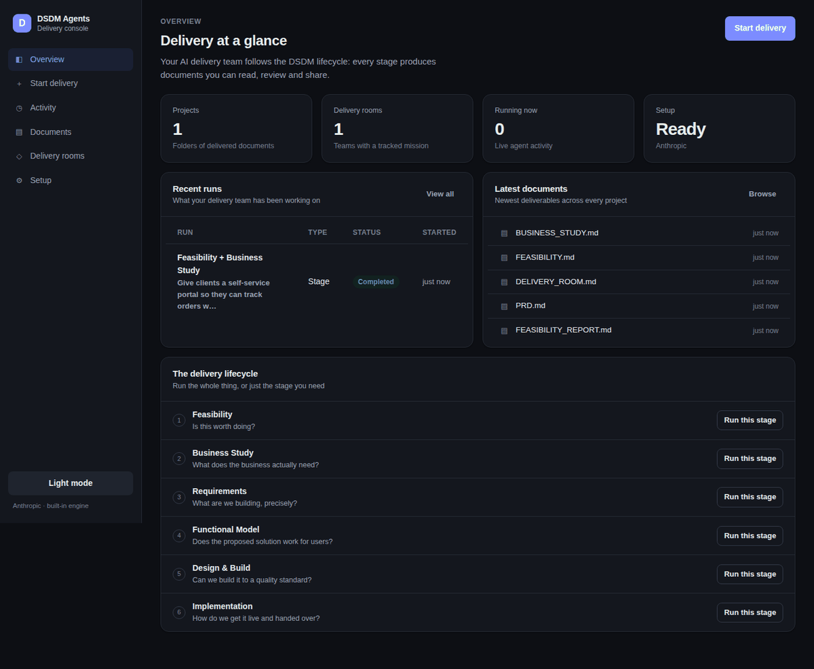

# DSDM Agents Console (GUI)

The console is a browser interface for people who would rather not use the
command line. It drives exactly the same agents, tools and delivery rooms as
`main.py` — nothing is simulated, and nothing is exclusive to one interface.

```bash
python main.py --gui
```

That starts a local web server on <http://localhost:8770> and opens your
browser. Press `Ctrl+C` in the terminal to stop it.

No extra packages are needed. The console is built on Python's standard
library plus plain HTML/CSS/JavaScript, so if `pip install -r requirements.txt`
succeeded, the console will run.


---

## Contents

- [Who it is for](#who-it-is-for)
- [Starting the console](#starting-the-console)
- [The pages](#the-pages)
- [Starting a delivery](#starting-a-delivery)
- [Oversight and approvals](#oversight-and-approvals)
- [Stopping and stepping back](#stopping-and-stepping-back)
- [Where documents go](#where-documents-go)
- [Console and CLI equivalents](#console-and-cli-equivalents)
- [Security model](#security-model)
- [Troubleshooting](#troubleshooting)
- [How it is built](#how-it-is-built)

---

## Who it is for

The console is aimed at business users — product owners, delivery managers,
sponsors and analysts — who need to commission work and read what comes back,
without learning phase ids or CLI flags.

It speaks in outcomes rather than internals:

| The console says | The CLI calls it |
|---|---|
| Requirements | `--phase prd_trd` |
| Design & Build | `--phase design_build` |
| Hands-off / Guided / Full control | `--mode automated` / `hybrid` / `manual` |
| Built-in / pi.dev engine | `--agent-runtime legacy` / `pi` |
| Delivery room | `--room-create` / `--room-run` |

---

## Starting the console

```bash
# default: http://localhost:8770, opens a browser
python main.py --gui

# choose a port
python main.py --gui --gui-port 9000

# do not open a browser (headless machines, remote sessions)
python main.py --gui --no-browser

# make it reachable from another machine on the network
python main.py --gui --gui-host 0.0.0.0
```

| Flag | Default | Purpose |
|---|---|---|
| `--gui` | off | Start the console instead of the CLI |
| `--gui-host` | `127.0.0.1` | Address to bind to |
| `--gui-port` | `8770` | Port to listen on |
| `--gui-token` | auto | Access token required by every request |
| `--no-browser` | off | Do not open a browser window |

Run it from the repository root — the console reads and writes `generated/`
relative to the working directory, exactly as the CLI does.

---

## The pages

### Overview

Projects, delivery rooms, live activity and the newest documents, plus a
one-click way to run any single stage of the lifecycle. It also follows your
system theme, and the sidebar toggle overrides it.



### Start delivery

A four-step wizard: describe the work, choose the scope, choose how closely you
want to supervise, review and start. Each stage says what it answers and what
it produces, so you are choosing outcomes rather than phase ids.


### Activity

Every run, past and present. Opening a run shows a live feed of what each agent
is doing, stage-by-stage progress, any approvals waiting on you, the documents
produced, and a collapsed technical log for when someone needs the raw output.


### Documents

Browse `generated/` by project and folder. Markdown renders inline — including
tables — so a PRD or feasibility report is readable without leaving the browser.


### Delivery rooms

Mission, assigned team, health score, blockers, decisions and handoffs for a
project. Rooms can be created without running any agents (no AI usage), and run
later.


### Setup

A checklist of everything the console needs, with the fix written next to
anything that is wrong. This is the page to send someone to when "it isn't
working".


---

## Starting a delivery

1. **Describe** what you want in business language. "A customer self-service
   portal so clients can track orders without calling support" is enough — no
   technical detail is required. Optionally name the project folder.
2. **Scope**: run the full lifecycle, pick individual stages, or set up a
   delivery room without running anything yet.
3. **Oversight**: how closely you want to supervise (see below).
4. **Review** and start.


Work begins immediately and the run page shows progress as it happens. Runs
execute one at a time — a second run queues rather than competing for the same
workspace.

---

## Oversight and approvals

| Level | What happens | CLI equivalent |
|---|---|---|
| **Hands-off** | Agents work autonomously and report back when a stage finishes | `--mode automated` |
| **Guided** | Agents work on their own, but sensitive actions and each stage transition wait for your approval | `--mode hybrid` |
| **Full control** | Every action waits for your approval | `--mode manual` |

When an approval is needed, the run page shows what the agent wants to do,
why, and the exact inputs it will use. Approve or decline; the agent continues
either way, and a declined action is reported back to it as denied.


Two safeguards are deliberate:

- An approval nobody answers within 15 minutes is **declined**, never
  auto-approved.
- **Implementation** and **DevOps & Quality** keep a stricter default than the
  level you pick when you choose Hands-off, matching the CLI. Deployment and
  pipeline changes are the two places where silent automation hurts most.

---

## Stopping and stepping back

### Stopping

"Stop run" cancels a queued run immediately and declines anything waiting for
approval. A step already in flight finishes first — the agent is not killed
mid-write.

Stopping halts the agents, but it does not un-write what they already produced.
That is what stepping back is for.

### Stepping back

The console saves a **restore point** immediately before each stage runs. Once
a run is no longer working — stopped, finished or failed — the run page lists
those points, newest first, and you can step back as many stages as you like:


Every row states three things before you commit to anything:

- how far back it goes ("2 steps back — before design & build");
- which stages it undoes;
- exactly which documents will be removed and which will be put back to their
  earlier version. Expanding a row lists them by name.

After stepping back, the run's stages return to *pending* and their outputs are
dropped, so the run reads as though those stages never happened. Two buttons
appear:

- **Undo step back** — one level of undo. The console copies the workspace
  before it changes anything, so a step back taken by mistake is recoverable.
- **Continue from &lt;stage&gt;** — start a fresh run over the remaining stages,
  with the same brief, project and oversight level. This is how you rework a
  stage: step back, change the brief if needed, and run forward again.

### What it will and will not touch

Stepping back is a file operation, so its boundaries are deliberately narrow:

- **Only this run's project folders.** A restore point records which folders
  under `generated/` the run wrote to. Those are replaced; folders the run
  created after that point are deleted. Every other project is left alone, even
  if something else changed it in the meantime.
- **Never outside `generated/`.** Every path is resolved and checked against the
  workspace root before anything is written or deleted.
- **Never silently partial.** If a file changed but no copy was kept — because
  it sat outside the run's own folders when the restore point was taken — it is
  reported as unrecoverable rather than quietly skipped.
- **Not while the run is working.** Rolling files back underneath a working
  agent would corrupt both, so stop the run first.

Restore points live in `.dsdm-console/checkpoints/`, outside `generated/`, so
they never appear in the document browser. They belong to the console process:
runs are held in memory, so the store is cleared when the console starts. A
project larger than 250 MB is recorded but not copied, and the console says so
on the affected restore point instead of offering an undo it cannot deliver.

Stepping back is scoped to one run. To undo work from an earlier run, open that
run in **Activity** and step back from there.

---

## Where documents go

Everything lands in `generated/<project>/`, the same place the CLI writes to.
The console never writes anywhere else, and it will not read anything outside
that folder — a request for a path above it is refused rather than served.

---

## Console and CLI equivalents

| In the console | On the command line |
|---|---|
| Start delivery → Full delivery | `python main.py --workflow --input "..."` |
| Start delivery → Selected stages | `python main.py --phase feasibility --input "..."` |
| Start delivery → Delivery room only | `python main.py --room-create --input "..."` |
| Delivery room → Run this room | `python main.py --room-run --input "..."` |
| Delivery room → Export dashboard | `python main.py --room-export --room-project <name>` |
| Setup page | `python main.py --pi-doctor` |
| Run page → Step back | *(console only — the CLI has no equivalent)* |

---

## Security model

The console can start real work and read your project documents, so it is
treated as a local, single-user tool:

- It binds to **loopback** by default — nothing outside the machine can reach it.
- The **`Host` header is checked** on every request, so a hostile page open in
  the same browser cannot use DNS rebinding to drive the console.
- Binding to a non-loopback address (`--gui-host 0.0.0.0`) **requires an access
  token**. One is generated automatically and included in the URL printed at
  startup; share that URL only with people who should be able to run agents.
- Document browsing is confined to `generated/`.
- The Setup page reports **whether** an API key is present. It never displays
  key values, and there is no way to change secrets from the browser — `.env`
  remains the only place credentials live.

---

## Troubleshooting

**"Setup is incomplete" when starting a run** — open the Setup page. Each
failing check has the exact fix underneath it. The usual cause is a missing
`ANTHROPIC_API_KEY` in `.env`. Restart the console after editing `.env`.

**The port is already in use** — `python main.py --gui --gui-port 9000`.

**No browser opens** — the URL is printed in the terminal; open it manually, or
pass `--no-browser` to stop the console from trying.

**"The console could not start" in the browser** — the page could not reach the
API. If a token is required, use the exact URL printed at startup (it contains
the token).

**A run seems stuck** — check the run page for an approval waiting on you.
Guided and Full control runs pause until you answer.

---

## How it is built

| Path | Purpose |
|---|---|
| `src/gui/server.py` | HTTP server, static assets, Host/token checks |
| `src/gui/api.py` | JSON API and routing table |
| `src/gui/runs.py` | Run queue, progress events, approvals, produced-file tracking |
| `src/gui/checkpoints.py` | Restore points: snapshot, preview and restore `generated/` |
| `src/gui/catalog.py` | Business-facing names for phases, modes, templates |
| `src/gui/workspace.py` | Read-only, sandboxed view of `generated/` |
| `src/gui/diagnostics.py` | Readiness checks behind the Setup page |
| `src/gui/static/` | `index.html`, `app.js`, `styles.css` — no build step, no CDN |

The screenshots in this guide are captured from a throwaway demo workspace, not
from anyone's real project.

The console does not re-implement any DSDM logic. Runs construct the same
`DSDMOrchestrator` the CLI builds, with the terminal prompt and progress
callbacks redirected to the browser. Tests live in `tests/test_gui.py`.
