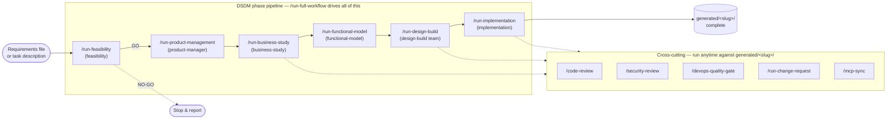

# DSDM Agents — Slash Command Guide

A practical guide to the DSDM Agents **slash commands** — the reusable task
prompts in `.github/prompts/` that drive the `.github/agents/` agent fleet
through the Dynamic Systems Development Method (DSDM) lifecycle. Written to
take you from "never run this repo before" to "I understand the whole
pipeline well enough to add my own command."

> New to the repo entirely? Start with [`GETTING_STARTED.md`](GETTING_STARTED.md)
> for environment setup. This guide assumes the environment already works and
> focuses specifically on the slash-command layer.

## Table of contents

1. [What "slash command" means in this repo](#1-what-slash-command-means-in-this-repo)
2. [Getting started](#2-getting-started)
3. [Command reference](#3-command-reference)
4. [Example outputs](#4-example-outputs)
5. [Deep dive for experts](#5-deep-dive-for-experts)
6. [Troubleshooting](#6-troubleshooting)

---

## 1. What "slash command" means in this repo

DSDM Agents ships two parallel interfaces onto the same underlying agents:

| Interface | Where | Backing files |
|---|---|---|
| **Python CLI** | `python main.py --phase ... / --workflow ...` | `src/agents/`, `src/orchestrator/` |
| **Slash commands** | GitHub Copilot CLI (`copilot`), Copilot Chat in VS Code, or any [AGENTS.md](https://agents.md/)-compatible tool | `.github/prompts/*.prompt.md` + `.github/agents/*.agent.md` |

The slash commands are **task prompts** — Markdown files with YAML
frontmatter (`mode: agent`, `description: ...`) that tell an AI coding agent
exactly which specialised agent to invoke, what inputs to collect, which
files must exist when it's done, and what to report back. Each one also
documents the equivalent `python main.py` invocation, so the two interfaces
stay interchangeable — pick whichever fits your workflow.

```
.github/
├── agents/            # WHO: one *.agent.md per DSDM role (feasibility, dev-lead, pen-tester, ...)
├── prompts/            # WHAT: one *.prompt.md per reusable task ("run feasibility", "code review", ...)
├── instructions/        # HOW: scoped rules (tools catalogue, integrations, MCP, conventions)
└── copilot/mcp-config.json   # external systems agents can reach (Atlassian, GitHub, filesystem)
```

Running a slash command means: an agent reads the `.prompt.md` task
definition, invokes the named `.agent.md` agent (which may hand off to
further agents), calls tools from the Python tool registry
(`src/tools/tool_registry.py`), and writes artefacts to
`generated/<project-slug>/`.

---

## 2. Getting started

### 2.1 Prerequisites

Same as the rest of the repo — see [`GETTING_STARTED.md`](GETTING_STARTED.md)
for the full walkthrough. Minimum to run slash commands:

- Python 3.10+, venv created, `pip install -r requirements.txt`
- `.env` configured with at least `ANTHROPIC_API_KEY` (or another provider)
- [GitHub Copilot CLI](https://docs.github.com/en/copilot/how-tos/copilot-cli)
  installed and authenticated (`npm install -g @githubnext/github-copilot-cli`
  or the current official package — check GitHub's docs for the latest
  install method), **or** the Copilot Chat extension in VS Code

### 2.2 Three ways to run a slash command

**A. Interactive `/` menu (fastest for exploring)**

```bash
cd dsdm-agents
copilot
```

Inside the CLI session, type `/` to see the available prompt files, or
`@` to pick an agent directly (`@feasibility`, `@design-build`, `@dev-lead`, …).

**B. Direct prompt-file invocation (fastest for scripting/CI)**

```bash
copilot --prompt-file .github/prompts/run-feasibility.prompt.md
```

The agent will then ask you (or read from stdin/args, depending on your
Copilot CLI version) for the inputs the prompt file lists — project
description, tech stack, constraints, etc.

**C. VS Code Copilot Chat**

Open the repo in VS Code, open Copilot Chat, and either use the agent picker
(`@feasibility`) or paste the contents of a `.prompt.md` file as your first
message. The same `.agent.md` files are auto-discovered.

### 2.3 Your first slash command

Run the cheapest, fastest one first — feasibility only, no code generation:

```bash
copilot --prompt-file .github/prompts/run-feasibility.prompt.md
```

When prompted, supply:
```
Project description: Build a customer feedback portal where users submit
                      feedback, admins triage it, and reports get emailed
                      weekly.
Proposed technology stack: React frontend, Node.js/Express API, PostgreSQL
Constraints: 6-week timeline, small team (2 devs), no compliance requirements
```

See [§4.1](#41-run-feasibility) for the full example output this produces.

Every slash command writes its artefacts under `generated/<project-slug>/` —
check that folder after each run rather than relying only on the chat
transcript.

---

## 3. Command reference

The phase-level commands chain into a linear pipeline (driven end-to-end by
`/run-full-workflow`); the rest are cross-cutting — run them against
`generated/<slug>/` whenever they're needed, not in a fixed order.



| Slash command | File | Invokes | Mode | Produces |
|---|---|---|---|---|
| **Full workflow** | `run-full-workflow.prompt.md` | all phase agents in sequence | mixed (per-phase default) | every doc below, chained |
| **Feasibility** | `run-feasibility.prompt.md` | `feasibility` | Automated | `FEASIBILITY_REPORT.md` |
| **Product management (PRD)** | `run-product-management.prompt.md` | `product-manager` | Automated | `PRODUCT_REQUIREMENTS.md` |
| **Business study** | `run-business-study.prompt.md` | `business-study` | Automated | `BUSINESS_STUDY.md`, `architecture/HIGH_LEVEL_ARCHITECTURE.md`, `RISK_LOG.md` |
| **Functional model iteration** | `run-functional-model.prompt.md` | `functional-model` | Automated | `prototypes/`, `FUNCTIONAL_MODEL_REPORT.md`, `NON_FUNCTIONAL_REQUIREMENTS.md` |
| **Design & Build** | `run-design-build.prompt.md` | `design-build` → `dev-lead`, `frontend-developer`, `backend-developer`, `automation-tester`, `nfr-tester`, `pen-tester` | Hybrid/Manual per role | `src/`, `tests/`, `TECHNICAL_REQUIREMENTS.md`, ADRs, `api/openapi.yaml` |
| **Implementation / deploy** | `run-implementation.prompt.md` | `implementation` | Manual (pauses before prod) | `DEPLOYMENT_PLAN.md`, `ROLLBACK_PLAN.md`, `TRAINING_MATERIALS.md`, `HANDOVER_DOCS.md`, `POST_IMPLEMENTATION_REVIEW.md` |
| **Code review** | `code-review.prompt.md` | `dev-lead` + `pen-tester` | — | severity-classified review report |
| **Security review** | `security-review.prompt.md` | `pen-tester` | Manual (confirm every scan) | `security/VULNERABILITY_ASSESSMENT.md`, `DEPENDENCY_REPORT.md`, `REMEDIATION_PLAN.md` |
| **DevOps quality gate** | `devops-quality-gate.prompt.md` | `devops` | Hybrid | pass/fail table against the 14 Development Principles |
| **Scope change request** | `run-change-request.prompt.md` | `change-control` | Hybrid (pauses if a Must-Have would be displaced) | `CHANGE_LOG.md` entry + re-prioritised MoSCoW list |
| **MCP sync** | `mcp-sync.prompt.md` | (any agent) + MCP CLI tools | dry-run unless `MCP_EXECUTE=1` | rendered commands + sync summary for Jira/Confluence/GitHub |

> `change-control` is not one of the original DSDM phase/specialist agents —
> it's added in this guide as a worked example of extending the fleet (see
> [§5.9](#59-writing-a-new-specialised-agent)). It's fully wired: registered
> in `src/agents/role_definitions.py`, passes `python main.py --generate-agents`
> with no drift, and its own agent file is at
> `.github/agents/change-control.agent.md`.

Every phase-level command also documents its **equivalent CLI invocation**
in its own frontmatter/body — e.g. `run-feasibility` maps 1:1 to
`python main.py --phase feasibility --input "..."`. Use whichever surface
suits the context (CLI for scripting/CI, slash commands for interactive
work with an AI pair).

---

## 4. Example outputs

These are illustrative transcripts of what each slash command reports back
in chat, based on a running example project — a **customer feedback
portal**. Real output varies with your model, provider, and project, but the
structure (sections, acceptance-criteria checks, file paths) is fixed by the
prompt files themselves.

The artefacts each transcript below claims to write are checked into this
repo for real, under
[`generated/customer-feedback-portal/`](generated/customer-feedback-portal/README.md) —
open them if you want to see a full example document rather than just the
chat summary. They were sourced from
[`examples/sample_feedback_portal.md`](examples/sample_feedback_portal.md).

### 4.1 `/run-feasibility`

```
> copilot --prompt-file .github/prompts/run-feasibility.prompt.md

Project description: Build a customer feedback portal — users submit
feedback, admins triage it, weekly email reports.
Proposed technology stack: React, Node.js/Express, PostgreSQL
Constraints: 6-week timeline, 2-person team, no compliance requirements

▸ Invoking agent: feasibility (mode: automated)

  Calling in parallel:
    • analyze_requirements(requirements_text="...", focus_areas=["auth","forms","admin","email"])
    • assess_technical_feasibility(technology_stack=["React","Node.js","PostgreSQL"], complexity_level="medium")
    • identify_risks(risk_areas=["technical","security","schedule","business"])

  project_init(project_name="customer-feedback-portal", project_type="node")
  → created generated/customer-feedback-portal/{src,tests,docs,config}

  file_write("generated/customer-feedback-portal/docs/FEASIBILITY_REPORT.md", ...)
  → 4,812 bytes written

✔ generated/customer-feedback-portal/docs/FEASIBILITY_REPORT.md exists

## Feasibility Assessment — Customer Feedback Portal

### Recommendation: GO (confidence: 87%)

### Technical feasibility
Standard CRUD + auth + email-digest stack. No novel technology risk;
React/Express/PostgreSQL is a well-trodden combination for this scale.

### Top risks
| # | Risk | Severity | Mitigation |
|---|------|----------|------------|
| 1 | 6-week timeline vs 2-person team | High | Cut "Could Have" scope first; timebox weekly |
| 2 | Weekly email digest delivery reliability | Medium | Use a managed transactional email provider (SES/SendGrid) |
| 3 | No auth provider decided yet | Medium | Default to email+password with bcrypt; defer SSO to a later release |
| 4 | Admin triage UX undefined | Low | Cover in Functional Model prototyping |

### DSDM fit
High — well-scoped MVP, iterative timeboxes suit the 6-week window.

### Suggested technology approach
React (Vite) SPA, Express REST API, PostgreSQL via Prisma, SendGrid for
digests, JWT session auth.

### Inputs needed for next phase (Product Management)
- Confirm auth strategy (email/password vs SSO)
- Confirm digest cadence and recipient list ownership

---
Summary: GO at 87% confidence. 4 risks logged, all mitigated. Report saved
to generated/customer-feedback-portal/docs/FEASIBILITY_REPORT.md. Ready for
/run-product-management.
```

Real file: [`generated/customer-feedback-portal/docs/FEASIBILITY_REPORT.md`](generated/customer-feedback-portal/docs/FEASIBILITY_REPORT.md)

### 4.2 `/run-product-management`

```
> copilot --prompt-file .github/prompts/run-product-management.prompt.md

Feasibility report path: generated/customer-feedback-portal/docs/FEASIBILITY_REPORT.md
Project slug: customer-feedback-portal

▸ Invoking agent: product-manager (mode: automated)

  generate_product_requirements_document(...)
  file_write("generated/customer-feedback-portal/docs/PRODUCT_REQUIREMENTS.md", ...)

✔ generated/customer-feedback-portal/docs/PRODUCT_REQUIREMENTS.md exists
✔ All 10 required PRD sections present

## PRD generated: Customer Feedback Portal

Feature counts by MoSCoW bucket:
  Must:   6   (auth, submit feedback, admin list view, admin triage status,
               weekly digest, feedback categories)
  Should: 3   (search/filter, CSV export, in-app notifications)
  Could:  2   (sentiment tagging, public roadmap board)
  Won't:  2   (mobile app, multi-language — this release)

Suggested MVP scope: all 6 Must-have items only, target end of week 4,
leaving weeks 5–6 for hardening + 2 Should-have stretch items.

---
Summary: PRD complete at generated/customer-feedback-portal/docs/PRODUCT_REQUIREMENTS.md.
Hand-off: this PRD is the primary input for /run-business-study and dev-lead's TRD.
```

Real file: [`generated/customer-feedback-portal/docs/PRODUCT_REQUIREMENTS.md`](generated/customer-feedback-portal/docs/PRODUCT_REQUIREMENTS.md)

### 4.3 `/run-business-study`

```
> copilot --prompt-file .github/prompts/run-business-study.prompt.md

PRD path: generated/customer-feedback-portal/docs/PRODUCT_REQUIREMENTS.md
Project slug: customer-feedback-portal

▸ Invoking agent: business-study (mode: automated)

  analyze_business_process(...) | identify_stakeholders(...) |
  prioritize_requirements(...) | define_architecture(...) |
  create_timebox_plan(...) | update_risk_log(...)

✔ generated/customer-feedback-portal/docs/BUSINESS_STUDY.md
✔ generated/customer-feedback-portal/docs/architecture/HIGH_LEVEL_ARCHITECTURE.md
✔ generated/customer-feedback-portal/docs/RISK_LOG.md

## Business Study — Customer Feedback Portal

Requirements: Must 6 · Should 3 · Could 2 · Won't 2  (all tagged MoSCoW)

High-level architecture: React SPA → Express REST API → PostgreSQL,
scheduled job (node-cron) for the weekly digest → SendGrid.

Timebox plan:
  Timebox 1 (wk 1–2): Auth + feedback submission
  Timebox 2 (wk 3–4): Admin triage + categories (MVP complete)
  Timebox 3 (wk 5–6): Digest emails, hardening, Should-have stretch

Risk log: 5 entries (4 carried from Feasibility + 1 new — "digest job
missing a run if the server restarts mid-cron").

---
Summary: Business Study complete. Ready for /run-design-build once the
Functional Model prototype is validated (or run design-build directly for a
CLI-first team).
```

Real files: [`BUSINESS_STUDY.md`](generated/customer-feedback-portal/docs/BUSINESS_STUDY.md) ·
[`architecture/HIGH_LEVEL_ARCHITECTURE.md`](generated/customer-feedback-portal/docs/architecture/HIGH_LEVEL_ARCHITECTURE.md) ·
[`RISK_LOG.md`](generated/customer-feedback-portal/docs/RISK_LOG.md)

### 4.4 `/run-design-build`

```
> copilot --prompt-file .github/prompts/run-design-build.prompt.md

PRD path: generated/customer-feedback-portal/docs/PRODUCT_REQUIREMENTS.md
Functional model report: generated/customer-feedback-portal/docs/FUNCTIONAL_MODEL_REPORT.md
Project slug: customer-feedback-portal
Tech stack: React (Vite) + Express + PostgreSQL (per Business Study)

▸ Invoking agent: design-build (mode: hybrid)

  ▸ Hand-off → dev-lead (hybrid)
      create_technical_design(...) → TECHNICAL_REQUIREMENTS.md
      create_adr("001-database-choice", "PostgreSQL over MongoDB — relational
                  feedback/category/user model") → architecture/decisions/001-database-choice.md

  ▸ Hand-off → frontend-developer (automated)
      generate_code → src/frontend/{components,pages,hooks}/*  (14 files)

  ▸ Hand-off → backend-developer (automated)
      generate_code → src/backend/{routes,services,models}/*   (11 files)
      → REST endpoints: POST /feedback, GET /feedback, PATCH /feedback/:id,
        GET /admin/digest-preview

  ▸ Hand-off → automation-tester (automated)
      generate_code (tests) → tests/unit/*, tests/integration/* (9 files)
      run_tests → 47 passed, 0 failed
      check_coverage → 84%

  ▸ Hand-off → nfr-tester (hybrid — chaos test requires approval, SKIPPED this run)
      run_performance_test → p95 218ms @ 50 rps (target <500ms) — PASS
      check_accessibility → 2 minor WCAG AA issues (contrast on secondary buttons)

  ▸ Hand-off → pen-tester (manual — awaiting approval)
      ⚠ Approval required to run: security_check(scope="generated/customer-feedback-portal/src")
      [approved]
      security_check → 0 Critical, 0 High, 1 Medium (missing rate limiting on
      POST /feedback), 2 Low

## Design & Build — Customer Feedback Portal

Files created: 34 (14 frontend, 11 backend, 9 test)
Tests: 47 passed / 0 failed · Coverage: 84% (≥80% gate met)
Security: 0 Critical / 0 High / 1 Medium / 2 Low — release NOT blocked
TRD: generated/customer-feedback-portal/docs/TECHNICAL_REQUIREMENTS.md

Ready-for-implementation checklist:
  [x] All tests pass
  [x] Lint clean
  [x] Coverage ≥ 80%
  [x] No Critical/High security findings
  [ ] Medium finding (rate limiting) — recommend fixing before prod, not blocking staging

---
Summary: Design & Build complete. 1 Medium security finding logged in
REMEDIATION_PLAN scope for /security-review. Ready for /run-implementation
(staging first).
```

Real files: [`TECHNICAL_REQUIREMENTS.md`](generated/customer-feedback-portal/docs/TECHNICAL_REQUIREMENTS.md) ·
[`architecture/decisions/001-database-choice.md`](generated/customer-feedback-portal/docs/architecture/decisions/001-database-choice.md)
(source code generation is summarised, not reproduced file-by-file, in this example)

### 4.5 `/code-review`

```
> copilot --prompt-file .github/prompts/code-review.prompt.md

Branch / PR: feature/feedback-triage-ui
Severity threshold: Medium and above

▸ Invoking agent: dev-lead (architecture/quality) + pen-tester (security)

## Code Review — feature/feedback-triage-ui

| Severity | File:Line | Finding | Suggested fix |
|---|---|---|---|
| High | src/backend/routes/feedback.js:42 | `PATCH /feedback/:id` accepts arbitrary status values, no enum check | Validate against `['new','triaged','resolved']` |
| Medium | src/backend/services/digest.js:18 | Cron job has no error handling if SendGrid call throws | Wrap in try/catch, log + retry with backoff |
| Medium | src/frontend/pages/AdminTriage.jsx:71 | Table re-renders on every keystroke in the filter box | Debounce the filter input (150ms) |
| Low | src/backend/models/Feedback.js:9 | Missing index on `status` column, used in the main admin query | Add `@@index([status])` in the Prisma schema |

Test coverage for changed files: 79% (below the 80% target — 1 branch
uncovered in `feedback.js` status-transition logic)

Documentation gaps: none — TRD already reflects this endpoint

### Overall recommendation: **Request Changes**
Blocking: the High finding (status enum validation). Everything else is
non-blocking but should be tracked.

---
_Reviewed by dev-lead + pen-tester per .github/prompts/code-review.prompt.md_
```

### 4.6 `/security-review`

```
> copilot --prompt-file .github/prompts/security-review.prompt.md

Scope: generated/customer-feedback-portal/src
Authorisation evidence: PROJ-118 (security review approved by eng lead)
Environment: staging

▸ Invoking agent: pen-tester (mode: manual)

⚠ Confirm authorisation before starting — [confirmed, PROJ-118 referenced]

  bandit 1.9.2 over Python sources        → N/A (Node.js project, skipped)
  safety 3.7.0 / pip-audit 2.10.0         → N/A (Node.js project, skipped)
  npm audit (equivalent SCA for Node)      → 1 moderate (lodash <4.17.21 in a
                                              transitive dep), 0 high/critical
  Secret scan over diff                    → clean
  Manual OWASP Top 10 review               → see findings below

## Security Review — Customer Feedback Portal (staging scope)

| Severity | Area | Finding |
|---|---|---|
| Medium | Input validation | `POST /feedback` has no rate limiting — vulnerable to submission spam |
| Medium | Dependency | `lodash@4.17.19` transitive via a dev dependency — CVE fixed in 4.17.21 |
| Low | Logging | Admin actions (status changes) aren't audit-logged |
| Informational | Auth | JWT expiry is 7 days — consider shortening for an admin-facing app |

Block-release findings: **none** (no Critical/High)

Artefacts:
  generated/customer-feedback-portal/docs/security/VULNERABILITY_ASSESSMENT.md
  generated/customer-feedback-portal/docs/security/DEPENDENCY_REPORT.md
  generated/customer-feedback-portal/docs/security/REMEDIATION_PLAN.md

---
Summary: No blocking findings. 2 Medium items recommended before public
launch (rate limiting, lodash bump). Cleared for /run-implementation to staging.
```

Real files: [`security/VULNERABILITY_ASSESSMENT.md`](generated/customer-feedback-portal/docs/security/VULNERABILITY_ASSESSMENT.md) ·
[`security/DEPENDENCY_REPORT.md`](generated/customer-feedback-portal/docs/security/DEPENDENCY_REPORT.md) ·
[`security/REMEDIATION_PLAN.md`](generated/customer-feedback-portal/docs/security/REMEDIATION_PLAN.md)

### 4.7 `/devops-quality-gate`

```
> copilot --prompt-file .github/prompts/devops-quality-gate.prompt.md

Project slug: customer-feedback-portal
Gate severity: pr

▸ Invoking agent: devops (mode: hybrid)

## DevOps Quality Gate — customer-feedback-portal (pr gate)

| Check | Result | Principle |
|---|---|---|
| run_tests (pytest/jest) | ✔ PASS — 47/47 | DP-3 Automate everything that can be automated |
| check_coverage | ✔ PASS — 84% (≥80%) | DP-3 |
| run_linter (ruff/eslint) | ✔ PASS — 0 errors, 3 warnings | DP-2 Build quality in |
| run_security_scan | ⚠ PASS WITH FINDINGS — 0 Critical/High, 1 Medium | DP-2 |

Block-release findings: none for `pr` gate.
(release gate would additionally require run_performance_test,
check_accessibility, analyze_dependencies — not run at pr level)

---
Summary: PR gate GREEN. Merge is not blocked; Medium finding tracked in
REMEDIATION_PLAN for the next release-gate run.
```

### 4.8 `/mcp-sync`

```
> copilot --prompt-file .github/prompts/mcp-sync.prompt.md

Project slug: customer-feedback-portal
Target system: atlassian
Feature: publish the business study + seed the Jira backlog from MoSCoW items

▸ mcp_list_servers()
  → ["atlassian", "github", "filesystem"]   (atlassian confirmed configured)

▸ mcp_list_tools(server="atlassian")
  → ["jira_create_issue", "confluence_create_page", "jira_create_user_story", ...]

▸ mcp_call_tool(server="atlassian", tool="confluence_create_page",
                 arguments={"space":"PROJ","title":"Business Study — Customer
                 Feedback Portal","body":"<...from BUSINESS_STUDY.md...>"})

  DRY RUN (MCP_EXECUTE not set) — rendered_command:
    mcp call --server atlassian --tool confluence_create_page \
      --arguments '{"space":"PROJ","title":"Business Study — Customer
      Feedback Portal","body":"..."}'

  Not executed. Set MCP_EXECUTE=1 and approve to run for real.

▸ mcp_call_tool(server="atlassian", tool="jira_create_user_story",
                 arguments={"project":"PROJ","summary":"Admin triage view",
                 "priority":"MoSCoW-Must"})
  DRY RUN — rendered_command shown, not executed.

## MCP Sync — customer-feedback-portal → atlassian

Rendered 6 commands (1 Confluence page, 5 Jira user stories tagged
MoSCoW-Must/Should). All dry-run — no secrets were passed as arguments;
credentials come from the atlassian server's own env block.

---
Summary: 6 commands staged, 0 executed (MCP_EXECUTE=0). Re-run with
MCP_EXECUTE=1 and approve each call to actually publish.
```

### 4.9 `/run-change-request`

This is the new command added in [§5.8-5.9](#59-writing-a-new-specialised-agent) —
included here so you can see the worked example run end-to-end, not just
read about the pattern.

```
> copilot --prompt-file .github/prompts/run-change-request.prompt.md

Project slug: customer-feedback-portal
Change description: Exec ask — combine CSV export with a new PDF export
option, requested as a Must Have.
Requested priority: Must Have
Source: VP Customer Success

▸ Invoking agent: change-control (mode: hybrid)

  file_read("generated/customer-feedback-portal/docs/PRODUCT_REQUIREMENTS.md")
  file_read("generated/customer-feedback-portal/docs/BUSINESS_STUDY.md")

  Classification: re-scope of existing Should-Have #8 ("Export to CSV"),
  requested at a higher priority than it currently holds.

  Checking for Must-Have trade capacity... none of the 6 existing Must-Haves
  have spare room this close to MVP (Timebox 3, week 5 of 6).

⚠ Elevating to Must Have would displace an existing Must-Have — stopping
  for stakeholder approval rather than resolving this unilaterally.

  [Stakeholder response: "Understood — ship it as Should-Have, defer the
  roadmap board."]

  prioritize_requirements(...) → Should: 3 (CSV export → CSV+PDF export)
                                  Could: 1 (-1, roadmap board → Future)
  update_risk_log(...) → no new risk (pdfkit is well-established)
  track_decision("CR-001", "...") → logged
  file_write("generated/customer-feedback-portal/docs/CHANGE_LOG.md", ...)
  jira_update_issue(...) | jira_add_comment(...) | sync_work_item_status(...)

✔ generated/customer-feedback-portal/docs/CHANGE_LOG.md updated (CR-001)
✔ generated/customer-feedback-portal/docs/RISK_LOG.md unchanged (no new risk)

## Change Request CR-001 — Customer Feedback Portal

Trade-off: add "Combined CSV+PDF export" at **Should Have** by deferring
"Public roadmap board" (Could-Have) to a future release. Escalation to
Must-Have was flagged to the Product Owner and declined in favour of the
Should-Have trade.

Updated MoSCoW counts: Must 6 (unchanged) · Should 3 · Could 1 (-1) · Won't 2

---
Summary: CR-001 logged. No Must-Have was displaced; roadmap board deferred.
Backlog and Confluence status log synced.
```

Real file: [`generated/customer-feedback-portal/docs/CHANGE_LOG.md`](generated/customer-feedback-portal/docs/CHANGE_LOG.md)

### 4.10 `/run-full-workflow`

```
> copilot --prompt-file .github/prompts/run-full-workflow.prompt.md

Project description: Build a customer feedback portal...
Project slug: customer-feedback-portal
Constraints: 6-week timeline, 2-person team

▸ Step 1/7 Feasibility          → GO (87%)                         ✔
▸ Step 2/7 Product Management   → PRD, 6 Must / 3 Should / 2 Could  ✔
▸ Step 3/7 Business Study       → architecture + timeboxes + risks ✔
▸ Step 4/7 Functional Model     → prototype, 2 feedback rounds      ✔
▸ Step 5/7 Design & Build       → 47/47 tests, 84% coverage         ✔
▸ Step 6/7 Implementation       → staging deployed, PAUSED for prod approval
▸ Step 7/7 DevOps (cross-cutting, ran throughout) → pr + release gates GREEN

## Full DSDM Workflow — customer-feedback-portal

| Phase | Status | Key artefact |
|---|---|---|
| Feasibility | ✔ | FEASIBILITY_REPORT.md (GO, 87%) |
| Product Management | ✔ | PRODUCT_REQUIREMENTS.md |
| Business Study | ✔ | BUSINESS_STUDY.md |
| Functional Model | ✔ | FUNCTIONAL_MODEL_REPORT.md |
| Design & Build | ✔ | TECHNICAL_REQUIREMENTS.md, 34 files, 84% coverage |
| Implementation | ⏸ awaiting approval | DEPLOYMENT_PLAN.md, ROLLBACK_PLAN.md (staging live) |
| DevOps (ongoing) | ✔ | pr + release gates green |

Tests: 47/47 · Coverage: 84% · Security: 0 Critical/High · TRD ↔ PRD linked

Outstanding decisions deferred to you:
  1. Approve production deployment (implementation agent is paused)
  2. Decide whether to fix the Medium rate-limiting finding before or after launch

---
Summary: 6 of 7 steps complete; production deploy is gated on your approval.
```

---

## 5. Deep dive for experts

### 5.1 Anatomy of a `.prompt.md` file

```yaml
---
mode: agent
description: One-liner shown in the picker / permission dialog.
---

# Task: <name>

## Inputs you need from the user
## Steps                       ← ordered; usually "invoke agent X" then verify artefacts
## Acceptance criteria / Output ← what must exist on disk, what to report
## Equivalent CLI invocation    ← keeps the CLI and slash-command surfaces equivalent
## Stop condition               ← prevents runaway tool-call loops
```

Every prompt file in `.github/prompts/` follows this shape. The **Stop
condition** section is load-bearing — per `AGENTS.md` convention #7 ("Stop
when done"), agents must summarise and halt once deliverables exist, not
keep looping on tool calls.

### 5.2 Anatomy of an `.agent.md` file

```yaml
---
name: <agent-id>              # used as the @<name> handle in chat
description: <one-liner>       # required, shown in the agent picker
tools: [read, write, edit, search, execute]
model: claude-sonnet-4-6       # optional pin
handoffs:                      # optional — ordered hand-off targets
  - label: "..."
    agent: <other-agent>
---
```

The body is the system prompt for that role: assessment focus, output file
rules (always under `generated/<project-slug>/docs/`), Jira/Confluence sync
guidance, and its own stop condition. `role_definitions.py` in
`src/agents/` is the single Python-side source of truth these files must
stay in sync with — run `python main.py --generate-agents` to check for
drift between `.agent.md` files, `ToolRegistry`, and `role_definitions.py`.

### 5.3 Execution modes and approval gates

Every agent runs in one of three modes (set per-phase/per-role, defaults
baked into each `.agent.md`):

| Mode | Behaviour | Roles that default to it |
|---|---|---|
| **Automated** | Tools run without approval | Feasibility, Product Mgmt, Business Study, Functional Model, Frontend Dev, Backend Dev, Automation Tester |
| **Hybrid** | Runs autonomously, pauses before risky/destructive steps | Design & Build (top level), Dev Lead, NFR Tester, DevOps, Change Control |
| **Manual** | Every action requires explicit approval | Implementation, Pen Tester |

This is why `/run-design-build`'s example transcript in §4.4 shows an
explicit `⚠ Approval required` pause before the pen-tester's
`security_check` call — Manual mode means every tool call blocks, not just
destructive ones.

### 5.4 The tool registry

Agents never call tools ad hoc — everything routes through
`src/tools/tool_registry.py`, which is what makes the CLI and slash-command
surfaces produce identical artefacts. Categories:

- **Phase tools** (`src/tools/dsdm_tools.py`) — `analyze_requirements`,
  `prioritize_requirements`, `create_technical_design`, `generate_code`, …
- **File/project tools** (`src/tools/file_tools.py`) — `project_init`,
  `file_write`, `directory_create`, … — every path lands under `generated/`
  automatically.
- **DevOps tools** (`src/tools/integrations/devops_tools.py`) — 28 tools
  across testing, CI/CD, infra, monitoring, NFRs, docs, task management,
  backup/recovery.
- **Atlassian tools** (`jira_tools.py`, `confluence_tools.py`) — first-party
  wrappers; prefer these over the MCP CLI when a named tool exists.
- **MCP CLI tools** (`mcp_tools.py`) — the escape hatch for anything not
  wrapped yet (see §5.5).

Full catalogue: `.github/instructions/dsdm-tools.instructions.md`.

### 5.5 The MCP CLI bridge — dry-run contract

`/mcp-sync` and any agent reaching Jira/Confluence/GitHub as an **MCP
server** rather than a first-party Python tool follow a strict safety
contract (`.github/instructions/mcp.instructions.md`):

1. `mcp_list_servers` — read-only, confirms what's configured. If the target
   isn't there, **silently skip** — never block a phase on integration
   availability.
2. `mcp_list_tools(server=...)` — read-only, discovers exact tool names.
3. `mcp_call_tool(server=..., tool=..., arguments={...})` — **dry-run by
   default**. It resolves and returns the `rendered_command` without
   executing anything. It only executes when `MCP_EXECUTE=1` (env or
   `.env`) **and** `$MCP_CLIENT` is configured, and even then it's marked
   `requires_approval` — Hybrid/Manual modes still pause for you.
4. `mcp_run_command` — raw protocol escape hatch for methods no tool wraps.

Never pass secrets/tokens as `arguments` — credentials live in each server's
`env` block in `.github/copilot/mcp-config.json`, sourced from the shell
environment.

### 5.6 Alternate execution runtime: pi.dev

By default every phase runs on the hand-rolled Python loop in
`src/agents/base_agent.py`. Passing `--agent-runtime pi` (Python CLI only,
not yet a slash command) routes eligible phases (feasibility,
business_study, functional_model, design_build, implementation, devops)
through [pi.dev](https://pi.dev/)'s TypeScript agent harness instead, via
`src/orchestrator/pi_session_runner.py` and the `pi/extensions/`
(`dsdm-tools-bridge`, `dsdm-approval-gate`) — same tool registry, same
approval semantics, different engine. This is the only path to a private
vLLM-hosted model:

```bash
DSDM_VLLM_BASE_URL=http://vllm.internal:8000/v1 DSDM_VLLM_MODEL_ID=my-open-model \
  python main.py --phase feasibility --agent-runtime pi --llm-provider vllm --input "..."

python main.py --pi-doctor --agent-runtime pi --llm-provider vllm   # diagnose without running
```

`PRD_TRD` always runs on the legacy path — its two-agent
Product-Manager/Dev-Lead sub-workflow hasn't been ported. See
`docs/category-defining-features/11-pi-agent-runtime/` for the migration
roadmap.

### 5.7 Beyond single phases: the Delivery Room

Slash commands run one phase (or the linear full workflow) at a time. For a
standing multi-agent team against one workspace — shared decision log,
blocker log, health score, cross-agent handoffs — use the Delivery Room
(Python CLI only today):

```bash
python main.py --room-run --input "Build a task management platform" --room-project "Task Platform"
python main.py --room-status --room-project task-platform
python main.py --room-dashboard --room-project task-platform --dashboard-sections blockers,decisions
```

See `docs/category-defining-features/01-autonomous-delivery-room/` and
`src/rooms/`.

### 5.8 Writing your own slash command

1. Create `.github/prompts/my-task.prompt.md` following the shape in §5.1.
2. Reference an existing agent (`.github/agents/*.agent.md`) or create a new
   one first (§5.9).
3. List concrete **acceptance criteria** — file paths that must exist,
   thresholds that must be met (coverage %, severity caps). This is what
   lets the agent self-verify instead of guessing when it's "done."
4. Add an **Equivalent CLI invocation** section if a Python-side equivalent
   exists or should — keeps the two surfaces from drifting.
5. Add a **Stop condition** — one sentence is enough: "post a summary and
   stop."
6. Update `.github/agents/README.md`'s task table and this guide's §3 table.

### 5.9 Writing a new specialised agent

1. Create `.github/agents/my-role.agent.md` with the frontmatter from §5.2.
2. Pick a mode (Automated/Hybrid/Manual) matching the blast radius of its
   tools — anything destructive (deploys, rollbacks, chaos tests, pen
   testing) should default to Hybrid or Manual.
3. Mirror the role in `src/agents/role_definitions.py` (the Python-side
   source of truth) so `--generate-agents` doesn't flag drift.
4. Add its tools to the registry (`src/tools/tool_registry.py`) if new ones
   are needed, and document them in
   `.github/instructions/dsdm-tools.instructions.md`.
5. Wire `handoffs` if this role should chain into another automatically
   (mirrors how `design-build` hands off to `dev-lead` → `frontend-developer`
   → … → `pen-tester`).
6. Run `python -m pytest tests/test_role_definitions.py` and
   `python main.py --generate-agents` — both must report no drift before
   the new agent is considered wired up.

**Worked example**: `change-control` (§3, §4.9) was added exactly this way
— see it end to end:
- `src/agents/change_control_agent.py` — the Python agent class, system
  prompt, and tool list (reuses existing tools only: `prioritize_requirements`,
  `update_risk_log`, `file_read`, `file_write`, `track_decision`,
  `jira_create_issue`, `jira_update_issue`, `jira_add_comment`,
  `sync_work_item_status` — no new tool had to be registered)
- `src/agents/role_definitions.py` — the `RoleDefinition(role_id="change-control", ...)` entry
- `.github/agents/change-control.agent.md` — the Copilot CLI agent file
- `.github/prompts/run-change-request.prompt.md` — the slash command
- `generated/customer-feedback-portal/docs/CHANGE_LOG.md` — a real output
  artefact from running it (transcript in §4.9)

### 5.10 Conventions every agent (and every slash command) must honour

From `AGENTS.md` / `.github/instructions/conventions.instructions.md`:

- **Output location** — `generated/<project-slug>/` only; never `src/`,
  `docs/`, or repo root.
- **MoSCoW everywhere** — every requirement/user story tagged Must/Should/Could/Won't.
- **Never compromise quality** (DSDM Principle #5) — tests pass, lint clean,
  security scan clean before a phase is marked complete.
- **Hand-off contract** — summarise artefacts produced + inputs the next
  phase needs, every time.
- **Locked paths** — `.azad/.locked-paths` lists files agents must never
  modify; currently just the `generated/.gitkeep` sentinel, but always check
  it before writing.
- **Stop when done** — no open-ended tool-call loops.

### 5.11 Slash command ↔ Python API mapping

For anyone building automation on top of this repo (CI pipelines, scripts),
every phase-level slash command has a direct Python equivalent:

```python
from src.orchestrator import DSDMOrchestrator, DSDMPhase, DesignBuildRole

orchestrator = DSDMOrchestrator(include_devops=True, include_jira=True, include_confluence=True)

# /run-feasibility  ==  run_phase(FEASIBILITY, ...)
result = orchestrator.run_phase(DSDMPhase.FEASIBILITY, "Build a customer feedback portal")

# /run-full-workflow  ==  run_workflow(...)
results = orchestrator.run_workflow("Build a customer feedback portal")

# /run-design-build (full team)  ==  run_design_build_team(...)
results = orchestrator.run_design_build_team(
    "Implement admin triage view",
    roles=[DesignBuildRole.DEV_LEAD, DesignBuildRole.FRONTEND_DEV, DesignBuildRole.BACKEND_DEV],
)
```

`change-control` isn't wired into `DSDMOrchestrator` (it's not a phase or a
`DesignBuildRole`) — invoke it directly, the way `examples/custom_tool_slack_notify.py`
invokes `FeasibilityAgent` directly:

```python
# /run-change-request  ==  ChangeControlAgent(...).run(...)
from src.agents.change_control_agent import ChangeControlAgent
from src.agents.base_agent import AgentMode
from src.tools.dsdm_tools import create_dsdm_tool_registry

agent = ChangeControlAgent(tool_registry=create_dsdm_tool_registry(include_jira=True), mode=AgentMode.HYBRID)
result = agent.run("Change request for customer-feedback-portal: ...")
```

### 5.12 Example files added by this guide

Everything below is a real, checked-in file — not a snippet in this
document — so you can open, run, or extend it directly:

| What | Where |
|---|---|
| Example generated artefacts (feasibility → security review → change log) | [`generated/customer-feedback-portal/`](generated/customer-feedback-portal/README.md) |
| Example requirements input files | [`examples/sample_feedback_portal.md`](examples/sample_feedback_portal.md), [`examples/sample_task_management.md`](examples/sample_task_management.md), [`examples/sample_legacy_migration.md`](examples/sample_legacy_migration.md) |
| Custom tool, runnable end to end | [`examples/custom_tool_slack_notify.py`](examples/custom_tool_slack_notify.py) — `python examples/custom_tool_slack_notify.py` |
| New slash command | [`.github/prompts/run-change-request.prompt.md`](.github/prompts/run-change-request.prompt.md) |
| New agent (fully wired, drift-checked) | [`.github/agents/change-control.agent.md`](.github/agents/change-control.agent.md), [`src/agents/change_control_agent.py`](src/agents/change_control_agent.py) |

The two requirements files beyond `sample_feedback_portal.md` map to the
other two Quick Start examples in `README.md`: `sample_task_management.md`
→ "Build a New Application from Scratch", `sample_legacy_migration.md` →
"Analyze and Plan a Migration Project". Feed either into a slash command or
the CLI, e.g.:

```bash
python main.py --phase feasibility --input "$(cat examples/sample_legacy_migration.md)"
```

---

## 6. Troubleshooting

| Symptom | Likely cause | Fix |
|---|---|---|
| Copilot CLI doesn't list any prompts under `/` | Not run from repo root, or Copilot CLI too old for `.agent.md`/`.prompt.md` discovery | `cd` to repo root; update Copilot CLI |
| Agent invents a different output path | Prompt/agent file's "File output rules" not being followed by the model | Re-run with a smaller, more capable model (`model:` frontmatter pin), or lower agent mode to Hybrid so you can catch it mid-run |
| MCP sync always says "not configured — skipping" | `.github/copilot/mcp-config.json` server name mismatch, or `MCP_CONFIG_PATH` overridden incorrectly | Check `mcp_list_servers()` output; verify env vars referenced in the config's `env` block are set |
| `mcp_call_tool` never actually executes | Dry-run is the default by design | Set `MCP_EXECUTE=1`, ensure `$MCP_CLIENT` is set, and approve when prompted |
| `--generate-agents` reports drift | `.agent.md` files and `role_definitions.py` disagree on tools/mode | Reconcile manually — `role_definitions.py` is the source of truth |
| Implementation phase hangs "awaiting approval" forever | Manual mode is working as intended — it always pauses before prod actions | Approve explicitly, or downgrade to Hybrid only if you understand the risk |
| Security/pen-tester agent refuses to run against production | By design — `security-review.prompt.md` forbids probing production without a separate change ticket | Point scope at `staging` or `local`, get a change ticket for prod |

For anything not covered here, see `README.md`'s own Troubleshooting
section (provider/API-key issues, dependency problems) and
`GETTING_STARTED.md`.
